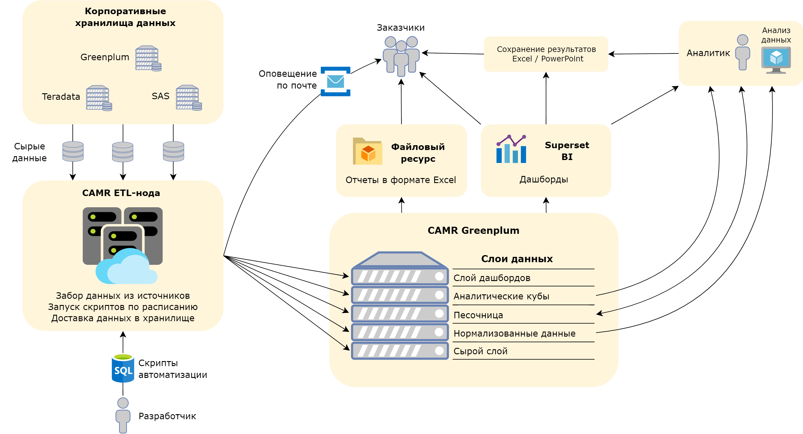

# Портфолио

## Проекты выполненные в компании [ПАО "МТС"](https://github.com/mustdayker/data_portfolio/tree/main/mts)

### [Продукт Коммерческая Аналитика Регион Москва (Data Engineer, Project Manager)](https://github.com/mustdayker/data_portfolio/blob/main/mts/mts_camr.ipynb)

Комплексный продукт реализованный в рамках работы отедал аналитики и развития отчетности. 

Включает в себя: 
- регистрацию и защиту продукта
- создание информационной системы
- создание команды поддержки
- прохождение информационной безопасности
- развертывание инфраструктуры
- написание документации

Ссылки:
[**Jupyter**](https://github.com/mustdayker/data_portfolio/blob/main/mts/mts_camr.ipynb)

### [Проект по реализации невостребованного оборудования (Project Manager, BI Engineer)](https://github.com/mustdayker/data_portfolio/blob/main/mts/mts_guz_device.ipynb)

Проект включает в себя разработку процесса по контролю, подготовке и реализации невостробованного оборудования в период санкций.

Ссылки:
[**Jupyter**](https://github.com/mustdayker/data_portfolio/blob/main/mts/mts_guz_device.ipynb)

-----
-----

### Учебные проекты из курсов Яндекс.Практикум

#### [Data Engineer](https://github.com/mustdayker/data_portfolio/blob/main/de/de_portfolio.md) ([Ссылка](https://github.com/mustdayker/data_portfolio/blob/main/de/de_portfolio.md))

Стек технологий:

|БД          | Языки   | Системы         | Технологии
|------------|---------|--------------   | ------
|`PostgreSQL`|`Python` |`HDFS`           |`Airflow`
|`MongoDB`   |`SQL`    |`Apache Spark`   |`Docker`
|`Redis`     |`NoSQL`  |`Spark Streaming`|`Git`
|`Vertica`   |`PySpark`|`Apache Kafka`   |`Datalens`
|`Metabase`  |         |`Yandex.Cloud`   | 

#### [Data Science](https://github.com/mustdayker/data_portfolio/blob/main/ds/ds_portfolio.md) ([Ссылка](https://github.com/mustdayker/data_portfolio/blob/main/ds/ds_portfolio.md))

Стек технологий:
| Библиотеки   |Языки и инструменты| Навыки        
|--------------|-------------------|--------------   
|`Pandas`      |`Python`           |`Предобработка данных`           
|`matplotlib`  |`SQL`              |`Исследовательский анализ данных`   
|`numpy`       |`Jupyter Notebook` |`Статистический анализ данных`
|`Scikit-learn`|                   |`Машинное обучение`   
|`scipy`       |                   |  
|`Catboost`    |                   |
|`lightgbm`    |                   |
|`xgboost`     |                   |
