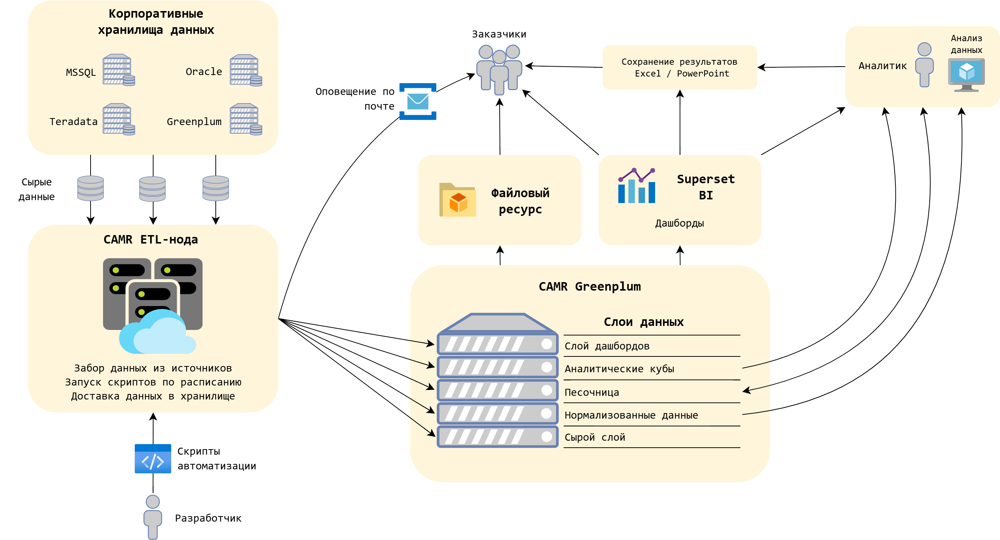
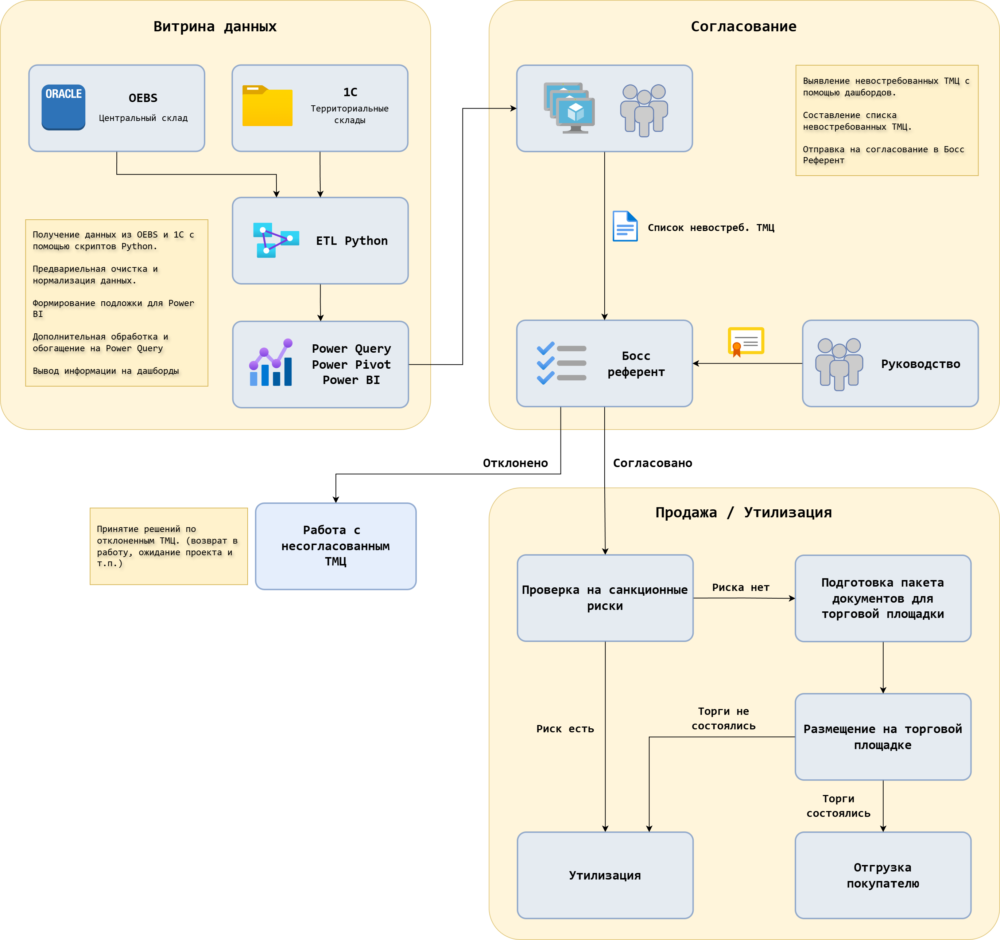
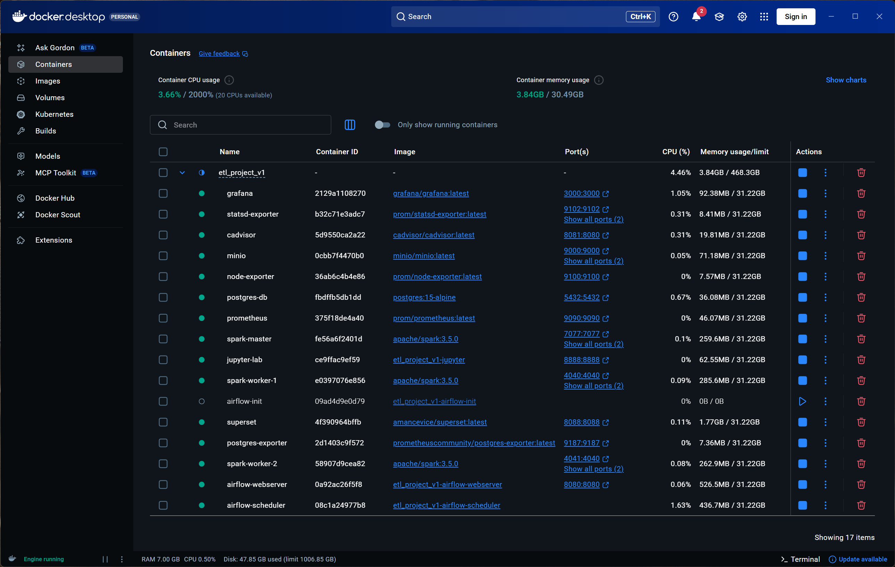
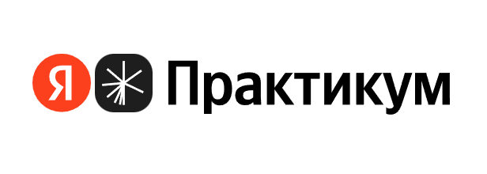

# Портфолио

-----

## Проекты, выполненные в компании ПАО "Сбербанк"

- 1
- 2
- 3

____

## Проекты, выполненные в компании [ПАО "МТС"](projects/mts)

-----

### [Продукт Коммерческая Аналитика Регион Москва (Data Engineer, Project Manager)](projects/mts/mts_camr.md)

Комплексный продукт по автоматизации обработки данных реализованный в рамках работы отдела аналитики и развития отчетности. 

Включает в себя: 
- Регистрацию и защиту продукта
- Создание информационной системы
- Развертывание инфраструктуры
- Написание документации

**Подробнее по ссылке:** [**CAMR**](projects/mts/mts_camr.md)

-----

### [Проект по реализации невостребованного оборудования (Project Manager, ETL, BI)](projects/mts/mts_device_sell.md)

Проект включает в себя разработку процесса по контролю, подготовке и реализации невостребованного оборудования в период санкций.

**Подробнее по ссылке:** [**Управление запасами**](projects/mts/mts_device_sell.md)

-----

## [Пет-проект](https://github.com/mustdayker/docker_projects/tree/main/etl_project_v1)

### [Data Engineering стек для оркестрации и анализа данных](https://github.com/mustdayker/docker_projects/tree/main/etl_project_v1)

Репозиторий и инструкция по сборке тут: [**Ссылка**](https://github.com/mustdayker/docker_projects/tree/main/etl_project_v1) 

В **Docker** был реализован учебный стенд по обработке данных, состоящий из следующих сервисов:

### 🗄️ Хранилище данных:
- `PostgreSQL` - основная БД для Airflow и Superset
- `MinIO` - объектное хранилище (аналог S3)
- `Clickhouse` - колоночная аналитическая БД
- `MongoDB` - документо-ориентированная БД
- `Redis` - in-memory кэш

### ⚙️ Управление данными:
- `Airflow` - оркестрация ETL/ELT процессов
- `Spark` - распределенная обработка данных (мастер + 2 воркера)
- `Kafka` - брокер сообщений
- `Iceberg` - DataLake > LakeHouse
- `Trino` - Распределенный движок SQL запросов

### 📊 Аналитика и визуализация:
- `Jupyter` - интерактивная разработка ноутбуков
- `Superset` - BI-платформа для дашбордов и аналитики

### 📈 Мониторинг:
- `Prometheus` - сбор и хранение метрик
- `Grafana` - визуализация метрик и дашборды

Полный список контейнеров:

-----

### Учебные проекты из курсов Яндекс.Практикум

-----

#### [Data Engineer](projects/practicum_de/readme.md) ([Ссылка](projects/practicum_de/readme.md))

Стек технологий:

|БД          | Языки   | Системы         | Технологии
|------------|---------|--------------   | ------
|`PostgreSQL`|`Python` |`HDFS`           |`Airflow`
|`MongoDB`   |`SQL`    |`Apache Spark`   |`Docker`
|`Redis`     |`NoSQL`  |`Spark Streaming`|`Git`
|`Vertica`   |`PySpark`|`Apache Kafka`   |`Datalens`
|`Metabase`  |         |`Yandex.Cloud`   | 

-----

#### [Data Science](projects/practicum_ds/readme.md) ([Ссылка](projects/practicum_ds/readme.md))

Стек технологий:

| Библиотеки   |Языки и инструменты| Навыки        
|--------------|-------------------|--------------   
|`Pandas`      |`Python`           |`Предобработка данных`           
|`matplotlib`  |`SQL`              |`Исследовательский анализ данных`   
|`numpy`       |`Jupyter Notebook` |`Статистический анализ данных`
|`Scikit-learn`|                   |`Машинное обучение`   
|`scipy`       |                   |  
|`Catboost`    |                   |
|`lightgbm`    |                   |
|`xgboost`     |                   |
