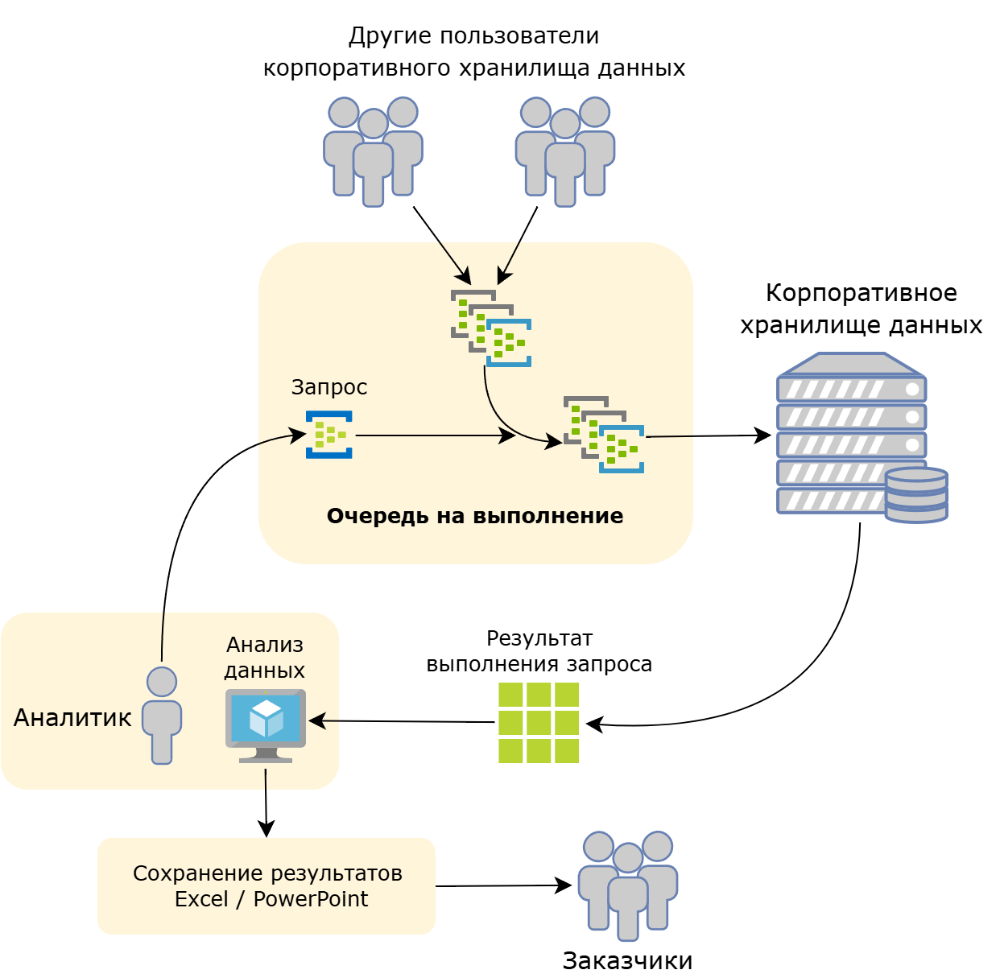
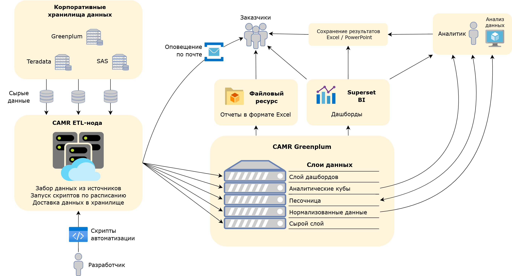

# Продукт CAMR (Commercial Analytics Moscow Region)

## Исходные проблемы:
- Ручная отправка запросов к корпоративным хранилищам данных
- Работа в целом винегрете ИС и как следствие синтаксисов: MSSQL, Teradata, SAS, Greenplum
- Ожидание выполнения запроса в очереди.
- Невозможность выполнять тяжелые запросы
- Невозможность накапливать очищенную и нормализованную информацию
- Несогласованность данных, ручное обновление
- Отсутствие автоматизации как класса

## Как было

-----

Было решено развертывать автоматизированную систему на основе инструментов используемых в компании. 

## Этапы создания
- Регистрация и защита продукта
- HLD схема
- Описание информационных потоков
- Защита ИБ
- манифест/приложение в едином архитектурном репозитории
- Команда поддержки
- Информационная система
- Создание ТУЗ
- Тенант
- ETL нода
- GP
- S3
- Мониторинг Grafana
- Настройка коннекторов и доступов
- Документация по системе
 

## Настройка
- Определение источников данных и их форматов
- Проектирование даг
- Составление расписания
- Настройка мониторинга
- Настройка бэкапов
- Документация по процессам

-----

## Что получилось

### Итоги реализации проекта
- Своя среда для накопления данных и выполнения высоконагруженных вычислений, нет искусственных ограничений и очередей на обработку данных
- Своя среда для выполнения автоматической обработки данных по расписанию (сбор, трансформация, создание регулярной отчетности и кубов, информирование)
 
 
### Польза для аналитика:
- Получение данных в предобработанном виде, сокращение времени на получение выборок и очистку
- Все в одном месте, не надо прыгать между хранилищами для сбора данных
- Отсутствие очередей на выполнение запросов
- Возможность обрабатывать большие массивы данных со сложной математикой
- Снижение порога на знание языка SQL 
 
### Польза для заказчика:
- Регулярное получение автоматически обновляемых отчетов в виде дашбордов и привычных Excel файлов
- Оповещение по почте
 
### Польза для бизнеса:
- Точность данных, система минимизирует ошибки связанные с ручной обработкой
- Быстрое принятие решений, отчетность всегда содержит актуальные данные за счет автообновления
- Масштабируемость, в систему можно добавлять дополнительные источники данных, адаптируя под новые задачи

### Основные сложности
- Работа в изолированной среде
- Разграничение доступов
