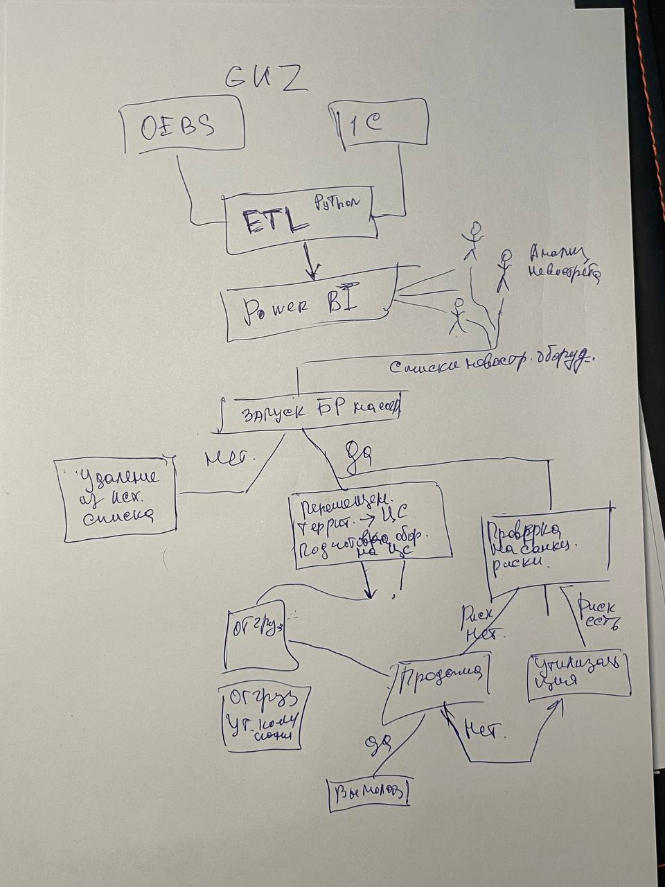

# Проект по реализации невостребованного оборудования

---

## Исходная проблема
Медленный сбор информации
Разные ИС
Плохая наблюдаемость ситуации
Отсутствие алгоритма на период санкций

## Как было

## Решение
- Автоматизация сбора из OEBS и 1С на Python
- Нормализация данных, обогащение информации, создание витрин и дашбордов на основе этих витрин. 
- Разработка регламента процесса с учетом санкционных ограничений

## Что получилось
- Скрипт автоматизации забирает данные из OEBS и 1С
- Нормализует и обогащает данные
- Генерирует витрины для дашбордов
- Заказчики анализируют ситуацию с помощью информации на дашбордах
- Отправляют списки не востребованного оборудования согласно форме
- Список запускается в БР на согласование 
- Что не согласовано удаляется из списка
- Что согласовано, направляется на цс и подготавливается
- БУЗ проверяет на санкции, прикладывает разрешения
- Готовится пакет доков на торги
- Торги
- Что продано то продано
- Что не продано утилизируем

