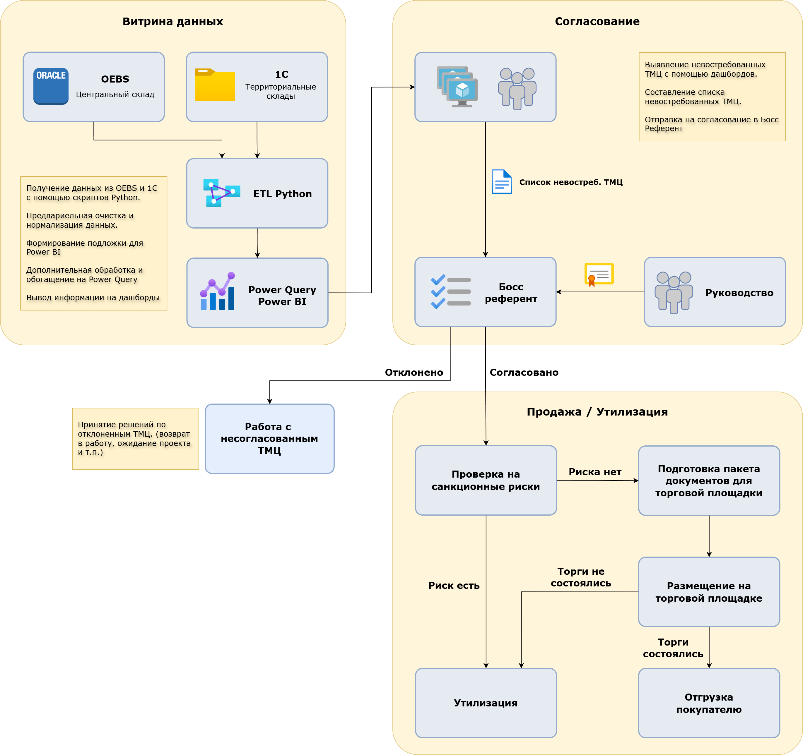

# Проект по реализации невостребованного оборудования

---

## Исходная проблема
- Медленный сбор информации
- Плохая наблюдаемость ситуации
- Отсутствие алгоритма на период санкций

## Решение
- Автоматизация сбора из `OEBS` и `1С` на `Python`
- Нормализация данных, обогащение информации, создание витрин и дашбордов на основе этих витрин. 
- Разработка регламента процесса с учетом санкционных ограничений

## Что получилось

