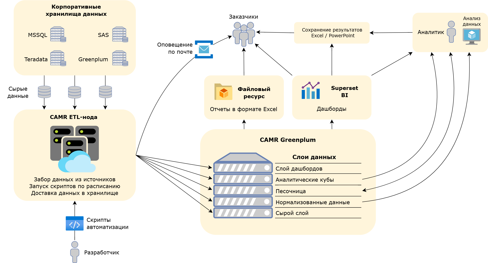

## Проекты выполненные в компании [ПАО "МТС"](projects/mts)

-----

### [Продукт Коммерческая Аналитика Регион Москва (Data Engineer, Project Manager)](mts_camr.md)

Комплексный продукт по автоматизации обработки данных реализованный в рамках работы отдела аналитики и развития отчетности. 

Включает в себя: 
- Регистрацию и защиту продукта
- Создание информационной системы
- Развертывание инфраструктуры
- Написание документации

**Подробнее по ссылке:** [**Markdown**](mts_camr.md) | [**PDF**](mts_camr.pdf)

-----

### [Проект по реализации невостребованного оборудования (Project Manager, ETL, BI)](mts_device_sell.md)

Проект включает в себя разработку процесса по контролю, подготовке и реализации невостробованного оборудования в период санкций.

**Подробнее по ссылке:** [**Markdown**](mts_device_sell.md) | [**PDF**](mts_device_sell.pdf)

